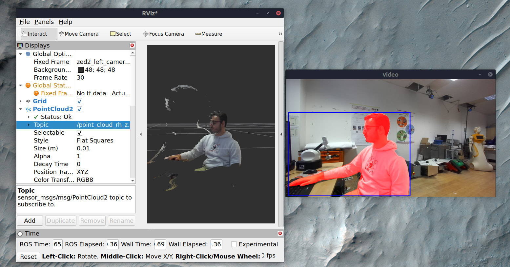

# zed_body_publisher
A ROS2 package that publishes the the segmented point cloud of the human body from the ZED camera.  
It also also send the skeleton data of the human body via TCP.  
Refers to [this](https://github.com/Hydran00/smplx_from_skeleton_tracking_ROS2/blob/main/smpl_tracking_node/scripts/body_json_parser.py) file to decode the skeleton data.  

## Dependencies
- OpenCV > 4.7
    1. Download [OpenCV latest](https://github.com/opencv/opencv/archive/4.11.0/opencv-4.11.0.tar.gz)
    2. Build OpenCV with the appropriate flags
    ```
    tar -xvzf opencv-4.11.0.tar.gz
    cd opencv-4.11.0
    mkdir build
    cd build
    cmake -D CMAKE_BUILD_TYPE=RELEASE -D CMAKE_INSTALL_PREFIX=/usr/local -D WITH_TBB=ON -D BUILD_NEW_PYTHON_SUPPORT=ON -D WITH_V4L=ON -D INSTALL_C_EXAMPLES=ON -D INSTALL_PYTHON_EXAMPLES=ON -D BUILD_EXAMPLES=ON -D WITH_QT=ON -D WITH_GTK=ON -D WITH_OPENGL=ON ..
    make -j$(nproc)
    sudo make install
    ```
    Also add the following flags to build with cuda
    ```
    -D WITH_CUDA=ON -D WITH_CUDNN=ON -D OPENCV_DNN_CUDA=0N
    ```
- CUDA
- ZED SDK
- libgtk
    ```
    sudo apt-get install libgtk2.0-dev
    ```

